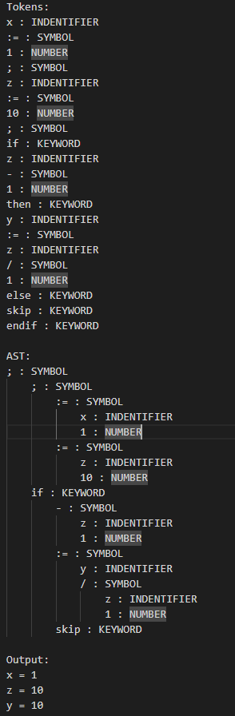

# Full-Language Interpreter using Python
This is a full language interpreter made with Python that supports assignment, if-statement, and while-loops. The interpreter allows you to write and execute programs written in a custom programming language.

# Features
- **Assignment**: Assign values to variables using the := operator. 
   - Syntax: "x := 12 * 3 + y"
- **If-Statements**: Use if statements to execute code conditionally. 
   - Syntax: "if condition then statement1 else statement2 endif"
- **While-Loops**: Use while loops to execute code repeatedly while a condition is true. 
   - Syntax: "while condition do statement1 endwhile"
   
**Note**: Numbers and expressions are used as boolean conditions in this language. For example, a "0" condition results to _False_. Everything greater than a "0" condition results to _True_. 

# Getting Started
1) Clone this repository and change directory to this project
2) go to "input_file.txt"(or make your own input file) and enter your own code
3) once done, run interpreter by typeing "python3 main.py -i input_file.txt -o _OutputFileName.txt_" in terimnal

# Usage 
The interpreter supports a custom programming language with the following syntax:


**Assignment**

To assign a value to a variable, use the following syntax:
```
variable_name := value
```

**If-Statements**

To execute code conditionally, use the following syntax:
```
if 1 then
   y := 1
else
   skip
endif
```

**While-Loops**

To execute code repeatedly while a condition is true, use the following syntax:
```
condition := 3;
result := 0;
while condition do:
    result := result + 1;
    condition := condition - 1
endwhile
```
# Output example

**Input Example:**


**Output Example:**



# Limitations

1) This langauge doesn't support negative numbers
2) All indentifers are defined globably regardless of scope
3) No functions
4) No OOP
6) Just imperative style progamming

# Learn more about language

[Token Scanner Phase](PR1.2.pdf)

[Parser Phase](PR2.2.pdf)

[Evaluator Phase](PR3.2.pdf)
